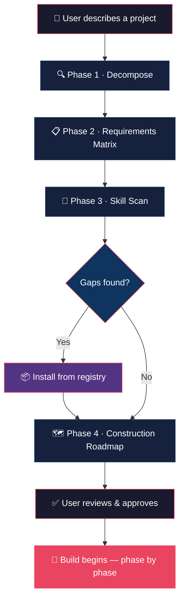

<div align="center">

# 🏗️ Project Blueprint

### Think before you build.

A universal AI agent skill that maps your project's full technical scope — architecture, dependencies, libraries, integrations — and cross-references your installed skills into a phased construction plan. Before a single line of code is written.

<br>

[](LICENSE)
[](SKILL.md)
[](#scripts)
[](#scripts)

<br>

[Quick Install](#-quick-install) · [How It Works](#-how-it-works) · [Compatibility](#-compatibility) · [Registry](#-built-in-skill-registry) · [Contributing](#-contributing)

</div>

<br>

---

<br>

## The Problem

Most AI agent projects fail not because the code is bad, but because the agent didn't fully understand what needed to be built.

A missing integration surfaces three phases too late. A dependency conflict emerges after hours of work. A critical requirement was never captured. And by the time you notice, half the project needs to be rewritten.

**Blueprint forces the agent to think before it acts.** It produces a structured plan you review and approve — catching gaps, contradictions, and missing pieces when fixing them costs nothing.

<br>

## ✨ What It Produces

When you describe a project, Blueprint outputs a single, structured artifact with four sections:

| Section | What's In It |
|:--------|:-------------|
| **Requirements Matrix** | Every component, endpoint, model, and integration — tagged with priority, technology choice, and justification |
| **Architecture Diagram** | Mermaid flowchart showing how the layers connect |
| **Skill Map** | Which of your installed skills handle which requirements — and what's missing |
| **Construction Roadmap** | Ordered phases with entry gates, deliverables, activated skills, and verification criteria |

You review it. You approve it. Then — and only then — the agent starts building.

> 📄 See a complete example: [`examples/sample_blueprint.md`](examples/sample_blueprint.md)

<br>

## 🔌 Compatibility

Blueprint works across every major AI coding agent. Same logic, different discovery paths.

<div align="center">

| Platform | Support | Install |
|:---------|:-------:|:--------|
|  Google Antigravity / Gemini CLI | ✅ Full | `agy skills install` or drop-in |
|  Claude Code | ✅ Full | Drop into `.claude/skills/` |
|  OpenAI Codex | ✅ Full | Drop into `.agents/skills/` |
|  Cursor | ⚡ Adapt | Paste into `.cursor/rules/blueprint.mdc` |
|  Windsurf | ⚡ Adapt | Paste into `.windsurfrules` |
|  Aider | ⚡ Adapt | Drop into `.aider/skills/` |
| Any `SKILL.md` agent | ✅ Full | Drop into your skills directory |

</div>

> **⚡ Adapt** = the platform doesn't natively read `SKILL.md`. Copy the core instructions into its own rule format. The skill logic is identical.

<br>

## 🚀 Quick Install

Choose your platform:

<details>
<summary><strong>Google Antigravity / Gemini CLI</strong></summary>

```bash
agy skills install github.com/RodDu/project-blueprint
```

Or manually:
```bash
git clone https://github.com/RodDu/project-blueprint.git
cp -r project-blueprint ~/.gemini/config/skills/project-blueprint
```
</details>

<details>
<summary><strong>Claude Code</strong></summary>

```bash
git clone https://github.com/RodDu/project-blueprint.git
cp -r project-blueprint ~/.claude/skills/project-blueprint
```
</details>

<details>
<summary><strong>OpenAI Codex</strong></summary>

```bash
git clone https://github.com/RodDu/project-blueprint.git
cp -r project-blueprint ~/.agents/skills/project-blueprint
```
</details>

<details>
<summary><strong>Cursor</strong></summary>

Copy the contents of `SKILL.md` into your project:
```
.cursor/rules/blueprint.mdc
```
Add the frontmatter Cursor expects (`description`, `globs`, `alwaysApply`).
</details>

<details>
<summary><strong>Windsurf</strong></summary>

Append the core instructions from `SKILL.md` to your `.windsurfrules` file.
</details>

<details>
<summary><strong>Generic / npx</strong></summary>

```bash
npx skills add RodDu/project-blueprint
```
</details>

<br>

## ⚙️ How It Works



<br>

**Phase 1 — Decompose.** Break the project into domains: backend, frontend, data, AI/ML, infrastructure, integrations, security. Each domain gets a structured breakdown of questions the agent must answer with evidence, not assumptions.

**Phase 2 — Requirements Matrix.** Every domain is expanded into a concrete table: what technology, why that choice, what it connects to, what it needs to run. This is the source of truth for the entire build.

**Phase 3 — Skill Scan.** The agent inventories *every* installed skill across all platform directories, matches them against the matrix, and classifies each as Critical, Recommended, or Optional. Missing capabilities are flagged.

**Phase 4 — Construction Roadmap.** Requirements are sequenced into ordered phases. Each phase has an entry gate (what must be true before starting), deliverables, activated skills, and a verification step to prove the phase is done.

<br>

## 💬 Usage

```
You: "I need a real-time dashboard showing WhatsApp message analytics
      with a FastAPI backend and React frontend."

Agent: [project-blueprint activates]

       ┌─────────────────────────────────────────┐
       │  📋 Requirements Matrix                 │
       │  ─────────────────────                  │
       │  Frontend:  React 18 + Vite + ECharts   │
       │  Backend:   FastAPI + uvicorn            │
       │  Database:  SQLite + SQLAlchemy          │
       │  AI/ML:     Gemma 4 (local sentiment)   │
       │  Auth:      HTTPBasic (single user)      │
       │                                         │
       │  🔎 Skill Scan: 47 installed, 8 matched │
       │  ⚠️  0 gaps found                       │
       │                                         │
       │  🗺️ Roadmap: 6 phases                   │
       │  Phase 0: Environment ──► Phase 5: Ship │
       └─────────────────────────────────────────┘

       Awaiting your approval to begin Phase 0.
```

<br>

## 📦 Built-in Skill Registry

Blueprint ships with a curated registry of proven agent skills. When the scan detects a gap, it can install what's needed — with your approval.

```bash
# Discover what your agent already has
python scripts/discover.py

# Browse the curated registry
python scripts/install.py --list

# Install a skill from the registry
python scripts/install.py ponytail
```

<details>
<summary><strong>Registry contents (15 skills)</strong></summary>

| Skill | Source | Categories |
|:------|:------:|:-----------|
| `ponytail` | [](https://github.com/seangeng/skills) | `meta` `quality` |
| `boil-the-ocean` | [](https://github.com/seangeng/skills) | `meta` `quality` |
| `plan-optimizer` | [](https://github.com/seangeng/skills) | `meta` `quality` |
| `write-like-a-human` | [](https://github.com/seangeng/skills) | `docs` `quality` |
| `ponytail-review` | [](https://github.com/seangeng/skills) | `testing` `quality` |
| `ponytail-audit` | [](https://github.com/seangeng/skills) | `testing` `quality` |
| `defuddle` | [](https://github.com/seangeng/skills) | `meta` `docs` |
| `block-disposable-emails` | [](https://github.com/seangeng/skills) | `security` `backend` |
| `managing-python-dependencies` |  | `python` `devops` |
| `building-data-apps` |  | `frontend` `data` |
| `ml-best-practices` |  | `ml` `data` |
| `technology-analyzer` |  | `meta` `docs` |
| `redesign-existing-projects` |  | `frontend` `design` |
| `high-end-visual-design` |  | `frontend` `design` |
| `image-to-code` |  | `frontend` `design` |

</details>

<br>

## 📁 Project Structure

```
project-blueprint/
├── SKILL.md                    # Core skill — the agent reads this
├── README.md                   # You are here
├── LICENSE                     # MIT
├── scripts/
│   ├── discover.py             # Cross-platform skill scanner (stdlib only)
│   ├── install.py              # Programmatic skill installer (stdlib + git)
│   └── registry.json           # Curated skill registry
└── examples/
    └── sample_blueprint.md     # Full example output
```

<br>

## 🛠️ Scripts

Both scripts are **zero-dependency** — Python standard library only. No pip install required.

| Script | What it does | Usage |
|:-------|:-------------|:------|
| `discover.py` | Detects your agent platform and inventories all installed skills | `python scripts/discover.py` |
| `install.py` | Downloads skills from GitHub into the correct directory | `python scripts/install.py <name>` |

```bash
# Discover supports custom workspace roots
python scripts/discover.py --workspace /path/to/project

# Install supports scope and platform targeting
python scripts/install.py ponytail --scope global --platform antigravity
```

<br>

## 🤝 Contributing

Contributions welcome. Three ways to help:

**Add a skill to the registry** — Edit `scripts/registry.json`, add the skill's GitHub URL and categories, open a PR.

**Report a bug** — [Open an issue](https://github.com/RodDu/project-blueprint/issues). Include your agent platform, Python version, and the error.

**Suggest an improvement** — Feature requests and workflow ideas are welcome as issues or discussions.

<br>

## 📄 License

[MIT](LICENSE) — use it anywhere, modify it freely, keep the attribution.

<br>

---

<div align="center">

Built for the open `SKILL.md` standard.

Inspired by [seangeng/skills](https://github.com/seangeng/skills).

**[⬆ Back to top](#-project-blueprint)**

</div>
