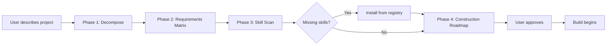

# 🏗️ Project Blueprint

**Analyze first, build second.** A universal AI agent skill that decomposes any project into a structured blueprint before a single line of code is written.


---

## What It Does

Project Blueprint is a planning skill for AI coding agents. When you describe a project — a SaaS app, an API integration, a CLI tool — the skill intercepts the impulse to start coding immediately and instead produces a comprehensive **blueprint**: a Requirements Matrix, a Skill Map, and a phased Construction Roadmap.

The Requirements Matrix breaks the project into concrete deliverables: backend services, frontend components, data models, integrations, infrastructure. Each item is tagged with priority, complexity, and dependencies. Nothing is left implicit.

The Skill Map scans every skill installed on your agent and matches them to the project's needs. If your agent has a `fastapi-scaffold` skill, it gets assigned to the backend phase. If it has a `react-component` skill, it handles the UI. If a critical capability is missing — say, authentication or database migrations — the skill flags the gap and can install what's needed from a curated registry. The Construction Roadmap then sequences everything into ordered phases, so the agent builds in the right order with the right tools.

## Why

Projects don't fail because agents write bad code. They fail because the agent didn't fully understand what needed to be built. A missing integration surfaces three phases too late. A dependency conflict emerges after hours of work. A critical requirement was never captured.

Blueprint solves this by making the agent **think before it acts**. The result is a structured plan that you review and approve before any code is generated — catching gaps, contradictions, and missing pieces when they're cheap to fix.

## Compatibility

| Platform | Status | Install Method |
|---|---|---|
| Google Antigravity / Gemini CLI | ✅ Full | `agy skills install` or drop-in |
| Claude Code | ✅ Full | Drop into `.claude/skills/` |
| OpenAI Codex | ✅ Full | Drop into `.agents/skills/` |
| Cursor | ⚡ Partial | Copy SKILL.md content into `.cursor/rules/blueprint.mdc` |
| Windsurf | ⚡ Partial | Paste core instructions into `.windsurfrules` |
| Any SKILL.md agent | ✅ Full | Drop into skills directory |

> **Partial support** means the platform doesn't natively read `SKILL.md` files, so the instructions must be pasted into the platform's own rule format. The skill logic is identical.

## Quick Install

```bash
# Antigravity CLI
agy skills install github.com/roddu/project-blueprint

# Claude Code / Codex / Generic — clone and copy
git clone https://github.com/roddu/project-blueprint.git
cp -r project-blueprint ~/.agents/skills/project-blueprint

# Or with npx
npx skills add roddu/project-blueprint
```

For **Cursor**, copy the contents of `SKILL.md` into:

```
.cursor/rules/blueprint.mdc
```

For **Windsurf**, append the core instructions from `SKILL.md` to your `.windsurfrules` file.

## How It Works



1. **Decompose** — The agent breaks the project description into domains (backend, frontend, data, infra, integrations).
2. **Requirements Matrix** — Each domain is expanded into specific deliverables with priority, complexity, and dependency tags.
3. **Skill Scan** — The agent inventories all installed skills and maps them to matrix items. Gaps are flagged.
4. **Construction Roadmap** — Deliverables are sequenced into ordered phases respecting dependencies. Each phase lists the skills that will execute it.

## Usage

```
You: "I need to build a real-time dashboard that shows WhatsApp message
      analytics with a FastAPI backend and React frontend."

Agent: [Activates project-blueprint skill]
       Generating Requirements Matrix...
       Scanning 47 installed skills...
       Found 8 applicable skills.
       [Produces full blueprint artifact]
```

The agent outputs a structured artifact containing:

- **Requirements Matrix** — Every component, endpoint, model, and integration listed with metadata.
- **Skill Map** — Which installed skills handle which requirements, and what's missing.
- **Construction Roadmap** — Ordered phases with clear entry/exit criteria.
- **Risk Log** — Identified gaps, assumptions, and open questions for your review.

You review the blueprint, approve or adjust, and then the agent begins building — phase by phase, skill by skill.

## Built-in Skill Registry

Blueprint ships with a curated registry of proven, open-source agent skills. When the Skill Scan detects a gap, it can pull from this registry to fill it.

```bash
# See what skills your agent currently has
python scripts/discover.py

# Browse the curated registry
python scripts/install.py --list

# Install a specific skill from the registry
python scripts/install.py --name fastapi-scaffold
```

The registry (`scripts/registry.json`) is community-maintained. To add a skill, open a PR — see [Contributing](#contributing).

## Project Structure

```
project-blueprint/
├── SKILL.md                    # Main skill instructions
├── README.md                   # This file
├── LICENSE                     # MIT License
├── scripts/
│   ├── discover.py             # Cross-platform skill scanner
│   ├── install.py              # Programmatic skill installer
│   └── registry.json           # Curated skill registry
└── examples/
    └── sample_blueprint.md     # Example blueprint output
```

## Contributing

Contributions are welcome. Here's how to help:

- **Add skills to the registry** — Open a PR editing `scripts/registry.json`. Include the skill's repo URL, a one-line description, and the domains it covers.
- **Report issues** — Use [GitHub Issues](https://github.com/roddu/project-blueprint/issues) for bugs, unexpected behavior, or platform compatibility problems.
- **Suggest improvements** — Feature requests and workflow ideas are welcome as issues or discussions.

Please keep PRs focused and include a clear description of what changed and why.

## License

This project is licensed under the [MIT License](LICENSE).

## Credits

- Inspired by the [seangeng/skills](https://github.com/seangeng/skills) ecosystem and the open agent skills standard.
- Built for any agent that reads `SKILL.md` — because planning should be portable.
