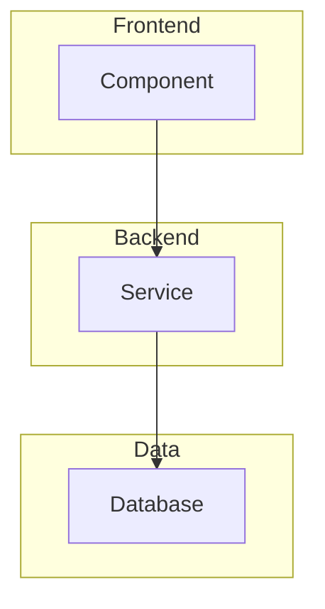

# Project Blueprint

Before writing a single line of code, understand the full picture. This skill
forces a structured reconnaissance phase that produces two deliverables: a
**Requirements Matrix** (what we're building) and a **Skill-Mapped Construction
Plan** (how we're building it, leveraging every installed skill that applies).

## Philosophy

Most projects fail not from bad code, but from incomplete understanding. The
Blueprint prevents three failure modes: (1) starting to code before
understanding the full scope, (2) reinventing what an installed skill already
solves, and (3) discovering missing dependencies or architectural conflicts
mid-build. Think of it as a senior architect's site survey before breaking
ground.

---

## Agent Ecosystem Compatibility

This skill is designed to work across every major AI coding agent. The core
logic is the same; only the discovery paths change.

| Agent Platform | Config File | Skills Location | Install Method |
|---|---|---|---|
| Antigravity / Gemini CLI | `.agents/skills/`, `~/.gemini/config/skills/` | `SKILL.md` | `agy skills install` |
| Claude Code | `CLAUDE.md` | `.claude/skills/`, `~/.claude/skills/` | Drop-in or `/install` |
| OpenAI Codex | `AGENTS.md` | `~/.agents/skills/`, `.agents/skills/` | Drop-in |
| Cursor | `.cursor/rules/*.mdc` | `.cursor/rules/` | Drop-in (`.mdc` format) |
| Windsurf | `.windsurfrules` | N/A (inline rules) | Paste into rules file |
| Aider | `.aider.conf.yml` | `.aider/skills/` | Drop-in |
| Generic | `AGENTS.md` | `skills/` | `npx skills add` |

When running under any platform, the agent should auto-detect its own
environment and resolve paths accordingly. **Never hardcode absolute paths.**

---

## Phase 1 — Project Decomposition (The "What")

Analyze the user's request and produce a structured breakdown. For each item,
gather evidence (ask the user, read existing code, search the web) — never
assume.

### 1.1 Problem Statement
- What problem does this project solve?
- Who is the end user?
- What is the definition of "done"?

### 1.2 System Boundaries
- What external systems does it connect to? (APIs, databases, services, devices)
- What data flows in and out?
- What are the trust boundaries? (auth, public/private, admin/user)

### 1.3 Architecture Layers

| Layer | Questions to Answer |
|-------|---------------------|
| **Frontend** | Framework? SPA/MPA/SSR? Mobile? Desktop? Terminal UI? |
| **Backend** | Language? Framework? REST/GraphQL/gRPC? Monolith/Microservices? |
| **Data** | Database type? ORM? Migrations? Caching layer? |
| **AI/ML** | Models? Inference (local/cloud)? Training pipeline? |
| **Infrastructure** | Hosting? CI/CD? Containers? Serverless? |
| **Integration** | Third-party APIs? Webhooks? Message queues? |
| **Security** | Auth method? Secrets management? Encryption? |

### 1.4 Runtime Model
- How does it run? (server, CLI, cron, event-driven, hybrid)
- Development environment setup (OS, runtimes, env vars)
- Deployment target (local, cloud, edge, embedded)

---

## Phase 2 — Requirements Matrix (The Deliverable)

Compile all findings into a single markdown artifact. This table is the
**source of truth** for the entire build. Write it as an artifact file
(`project_blueprint.md`).

### Template

```markdown
# Project Blueprint: [Project Name]

## 1. Problem & Scope

| Attribute | Value |
|-----------|-------|
| **Problem Statement** | [One sentence] |
| **End User** | [Who uses this] |
| **Definition of Done** | [Measurable acceptance criteria] |

## 2. Architecture Overview



## 3. Technical Requirements Matrix

| Category | Requirement | Technology/Library | Justification |
|----------|------------|-------------------|---------------|
| Frontend | [e.g., SPA with routing] | [e.g., React + React Router] | [Why] |
| Backend | [e.g., REST API] | [e.g., FastAPI] | [Why] |
| Database | [e.g., Document store] | [e.g., MongoDB] | [Why] |
| Auth | [e.g., JWT tokens] | [e.g., python-jose] | [Why] |
| AI/ML | [e.g., Text classification] | [e.g., scikit-learn] | [Why] |
| DevOps | [e.g., Containerization] | [e.g., Docker] | [Why] |

## 4. External Connections

| System | Protocol | Direction | Auth Method |
|--------|----------|-----------|-------------|
| [e.g., Stripe API] | HTTPS/REST | Outbound | API Key |

## 5. Environment Requirements

| Requirement | Value |
|-------------|-------|
| **Runtime** | [e.g., Python 3.11+, Node 20+] |
| **OS** | [e.g., Windows 11, Linux] |
| **RAM (min)** | [e.g., 4GB] |
| **Network** | [e.g., Internet required for API calls] |

## 6. Risk Register

| Risk | Impact | Mitigation |
|------|--------|------------|
| [e.g., API rate limiting] | High/Med/Low | [e.g., Exponential backoff] |
```

---

## Phase 3 — Skill Inventory Scan (The "How")

This is the differentiator. After producing the Requirements Matrix, the agent
MUST scan ALL installed skills and map which ones apply to this project.

### 3.1 Dynamic Discovery Procedure

The agent MUST discover skills by scanning these locations **in order**,
resolving `~` to the current user's home directory at runtime.

**1. Workspace-local skills** (relative to project root):

| Path Pattern | Format |
|---|---|
| `.agents/skills/*/SKILL.md` | Antigravity / Codex |
| `.claude/skills/*/SKILL.md` | Claude Code |
| `.cursor/rules/*.mdc` | Cursor |
| `skills/*/SKILL.md` | Generic |

**2. User-global skills** (platform-dependent):

| Path Pattern | Platform |
|---|---|
| `~/.gemini/config/skills/*/SKILL.md` | Antigravity / Gemini CLI |
| `~/.gemini/antigravity-cli/skills/*/SKILL.md` | Antigravity CLI (alt) |
| `~/.claude/skills/*/SKILL.md` | Claude Code |
| `~/.agents/skills/*/SKILL.md` | Codex |
| `~/.aider/skills/*/SKILL.md` | Aider |
| `~/.config/skills/*/SKILL.md` | Generic Linux/Mac |

**3. Plugin skills:**

| Path Pattern | Platform |
|---|---|
| `~/.gemini/config/plugins/*/skills/*/SKILL.md` | Antigravity plugins |

**For each discovered skill directory:**
1. List all subdirectories.
2. Read the `SKILL.md` (or `*.mdc`) **frontmatter only** (`name` + `description`).
   Do NOT read the full body unless the description suggests relevance.
3. Skip directories with no `SKILL.md`.
4. Build an in-memory inventory: `{ name, description, path, format }`.

### 3.2 Matching Algorithm

For each row in the Requirements Matrix:
1. Semantic-match the requirement description against all skill descriptions.
2. Classify each match:
   - **Critical** — project depends on it; must activate.
   - **Recommended** — significantly improves quality or speed.
   - **Optional** — nice to have, not essential.
3. Note which construction phase (0–5) the skill applies to.

### 3.3 Skill Map Table

```markdown
## 7. Skill Map

| Skill Name | Relevance | Phase | How It Applies |
|------------|-----------|-------|----------------|
| `managing-python-dependencies` | Critical | 0 – Setup | Manages venv and deps correctly |
| `ponytail` | Recommended | All | Prevents over-engineering |
| `boil-the-ocean` | Recommended | All | Ensures completeness |
| `building-data-apps` | Critical | 3 – Frontend | Guides dashboard framework choice |
| `plan-optimizer` | Recommended | Planning | Iterates the construction plan |
```

### 3.4 On-Demand Installation

If the Requirements Matrix identifies a need that **no installed skill covers**,
but the built-in registry lists a known skill for that need:

1. Present the recommendation to the user with name, description, and source.
2. If approved, clone/copy the skill into the appropriate skills directory
   for the detected agent platform.
3. Re-run the Skill Map step to include the newly installed skill.

To check the registry for available skills, the agent should read the file
`scripts/registry.json` **relative to THIS skill's installation directory**.
The registry maps skill names to GitHub URLs, categories, and descriptions.

---

## Phase 4 — Construction Roadmap (The Plan)

Using the Requirements Matrix and Skill Map, build a phased construction plan.
Each phase must reference activated skills by name.

### Template

```markdown
## 8. Construction Roadmap

### Phase 0: Environment & Foundation
- **Gate**: User approved the blueprint
- **Skills**: [list activated skills]
- **Actions**:
  1. Set up project directory structure
  2. Initialize dependency manager
  3. Create `.env` template with required secrets
  4. Install core dependencies
- **Deliverable**: Running empty project with deps installed
- **Verification**: Core imports succeed

### Phase 1: Data Layer
- **Gate**: Phase 0 complete
- **Skills**: [list activated skills]
- **Actions**:
  1. Define data models / schemas
  2. Set up database connection
  3. Create migrations
  4. Write seed data script
- **Deliverable**: Database schema deployed and seeded
- **Verification**: Query returns seed data

### Phase 2: Backend / API
- **Gate**: Phase 1 complete
- **Skills**: [list activated skills]
- **Actions**:
  1. Implement core API endpoints
  2. Add authentication layer
  3. Add input validation
  4. Write smoke tests
- **Deliverable**: API responding to requests
- **Verification**: All smoke tests pass

### Phase 3: Frontend / UI
- **Gate**: Phase 2 complete
- **Skills**: [list activated skills]
- **Actions**:
  1. Set up frontend framework
  2. Build core views/pages
  3. Connect to backend API
  4. Apply design system
- **Deliverable**: UI rendering real data
- **Verification**: Visual inspection + browser test

### Phase 4: Integration & Polish
- **Gate**: Phases 2–3 complete
- **Skills**: [list activated skills]
- **Actions**:
  1. Connect external services
  2. Error handling & edge cases
  3. Loading/empty/error states
  4. Performance pass
- **Deliverable**: Feature-complete application
- **Verification**: End-to-end user flow works

### Phase 5: Verification & Ship
- **Gate**: Phase 4 complete
- **Skills**: [list activated skills]
- **Actions**:
  1. Run full test suite
  2. Security review (if applicable)
  3. Documentation (README, API docs)
  4. Deploy or package
- **Deliverable**: Shipped product
- **Verification**: User acceptance
```

---

## Execution Rules

1. **Blueprint BEFORE code.** Never skip the blueprint for non-trivial projects.
   Exception: the user explicitly says "skip the blueprint" or the task is
   trivially simple (single file, single function).

2. **Evidence over assumption.** Every cell in the Requirements Matrix must come
   from evidence: user's words, existing code, documentation, or web research.
   If you don't know, ask or research — never guess.

3. **Ponytail applies to the blueprint itself.** The blueprint should be as
   short as it can be while remaining complete. No fluff sections, no
   speculative rows. If a layer doesn't apply (e.g., no ML), omit it.

4. **The Skill Map is mandatory.** Skipping the skill scan is a bug. A blueprint
   without a Skill Map is just a generic architecture document.

5. **Plan-Optimizer integration.** If the project is complex (4+ phases, 3+
   external integrations), run the Construction Roadmap through the
   `plan-optimizer` skill's score-critique-rewrite loop before presenting.

6. **Approval gate.** Present the complete blueprint and STOP. Do not begin
   Phase 0 until the user explicitly approves. The blueprint is a contract —
   changing it mid-build requires re-approval.

7. **Living document.** The blueprint is updated as the build progresses.
   If a later phase reveals a missing dependency, add it to the Requirements
   Matrix and note the change.

8. **Boil-the-ocean mindset.** The blueprint must be thorough enough that
   whoever reads it says "this person understood every angle." Don't ship a
   skeleton — ship the real thing.

9. **Cross-platform awareness.** When the skill scan discovers skills from a
   different agent platform format (e.g., `.mdc` for Cursor, inline rules for
   Windsurf), the agent should still read and leverage their instructions,
   adapting syntax and conventions as needed.

---

## Anti-Patterns

- **Blueprint theater**: a 200-line document that restates the obvious without
  adding insight. Every row must earn its place.
- **Analysis paralysis**: spending 2 hours on the blueprint for a 30-minute
  project. Scale the depth to the project's complexity.
- **Ignoring the Skill Map**: producing a generic plan that could come from
  any LLM, ignoring the specialized skills available.
- **Speculative requirements**: adding "we might need Redis" without evidence.
  If it's speculative, it goes in the Risk Register, not the Requirements
  Matrix.
- **Platform lock-in**: writing a blueprint that only works with one agent
  platform's features or assumes a specific tool installation path.

---

## Gotchas (Armadilhas e Pontos de Falha Comuns)

> **Diretriz de Aprendizado Contínuo:** Esta seção deve ser lida antes da
> execução e **atualizada (populada)** sempre que o agente encontrar uma nova
> falha, loop ou erro sistêmico. O objetivo é que o sistema aprenda com os
> próprios erros e não os repita.

- **EPERM em pasta sincronizada:** Nunca instalar `node_modules` ou `.venv`
  dentro de pastas do Google Drive/OneDrive/Dropbox. O blueprint deve
  especificar um local de instalação em disco local.
- **Blueprint sem Skill Map:** Se o agente produzir um blueprint sem a seção 7
  (Skill Map), a skill NÃO foi executada corretamente. Voltar e completar.
- **Leitura excessiva de SKILL.md:** Ler o corpo completo de cada SKILL.md
  durante o inventário desperdiça contexto. Ler **apenas o frontmatter**
  (name + description) no scan inicial; ler o corpo somente para skills
  classificadas como Critical ou Recommended.
- **Falha de API (loops infinitos):** Não entre em loops de retry para APIs
  ou serviços que não respondem. Se houver falha de rede/API, pare, notifique
  o usuário e mude a estratégia.
