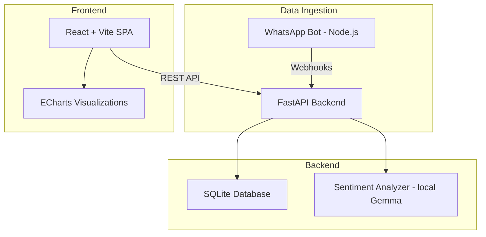

# Project Blueprint: WhatsApp Analytics Dashboard

> Generated by `project-blueprint` skill — 2026-07-23

## 1. Problem & Scope

| Attribute | Value |
|-----------|-------|
| **Problem Statement** | Real-time visualization of WhatsApp message metrics (volume, response time, sentiment) for a small business |
| **End User** | Business owner monitoring customer support quality via WhatsApp |
| **Definition of Done** | Dashboard displays live message counts, avg response time, and sentiment score; updates every 60s; accessible via browser |

## 2. Architecture Overview

## 3. Technical Requirements Matrix

| Category | Requirement | Technology/Library | Justification |
|----------|------------|-------------------|---------------|
| Frontend | SPA with real-time charts | React 18 + Vite | Already in project stack; fast HMR |
| Frontend | Data visualization | ECharts (via echarts-for-react) | Rich chart library, good React integration |
| Backend | REST API + WebSocket | FastAPI + uvicorn | Async native, auto-docs, WebSocket support |
| Backend | Task scheduling | APScheduler | Lightweight, no external broker needed |
| Database | Relational store | SQLite + SQLAlchemy | Simple deployment, sufficient for single-user |
| AI/ML | Sentiment analysis | google-genai (Gemma 4 local) | Runs locally, no API costs |
| Auth | Basic auth | FastAPI HTTPBasic | Single user, no complex auth needed |

## 4. External Connections

| System | Protocol | Direction | Auth Method |
|--------|----------|-----------|-------------|
| WhatsApp Bot (existing) | HTTP POST webhook | Inbound | Shared secret header |
| Gemma 4 (local Ollama) | HTTP localhost:11434 | Outbound | None (local) |

## 5. Environment Requirements

| Requirement | Value |
|-------------|-------|
| **Runtime** | Python 3.11+, Node 20+ (existing bot) |
| **OS** | Windows 11 |
| **RAM (min)** | 8GB (Gemma inference) |
| **Disk** | 500MB |
| **GPU** | Optional (CPU inference ok for small volume) |
| **Network** | Local only (no cloud deploy) |

## 6. Risk Register

| Risk | Impact | Mitigation |
|------|--------|-----------|
| SQLite lock contention under concurrent writes | Medium | Use WAL mode; single writer pattern |
| Gemma inference latency spikes on CPU | Low | Queue sentiment jobs; batch every 30s |
| WhatsApp bot webhook reliability | Medium | Retry queue with exponential backoff |

## 7. Skill Map

| Skill Name | Relevance | Phase | How It Applies |
|------------|-----------|-------|---------------|
| `managing-python-dependencies` | **Critical** | Phase 0 | Sets up venv, manages FastAPI + SQLAlchemy deps |
| `ponytail` | **Recommended** | All | Prevents over-engineering the dashboard |
| `boil-the-ocean` | **Recommended** | All | Ensures complete implementation, not just MVP |
| `building-data-apps` | **Critical** | Phase 3 | Guides React+Vite dashboard architecture |
| `ml-best-practices` | **Recommended** | Phase 2 | Structures sentiment analysis pipeline |
| `redesign-existing-projects` | **Optional** | Phase 4 | Premium UI polish if time allows |
| `plan-optimizer` | **Recommended** | Phase 0 | Score and iterate this construction plan |
| `technology-analyzer` | **Optional** | Phase 0 | Evaluate ECharts vs alternatives |

### Missing Skills (Registry Recommendations)

| Need | Suggested Skill | Source | Action |
|------|----------------|--------|--------|
| WebSocket real-time patterns | `gemini-live-api-dev` | builtin | Already installed |
| No gaps identified | — | — | — |

## 8. Construction Roadmap

### Phase 0: Environment & Foundation
- **Gate**: User approved this blueprint
- **Skills**: `managing-python-dependencies`, `ponytail`
- **Actions**:
  1. Create project at `C:\Users\roddu\whatsapp-dashboard\` (local, not Drive)
  2. `python -m venv .venv` → install FastAPI, SQLAlchemy, uvicorn, APScheduler
  3. `npm create vite@latest frontend -- --template react`
  4. Create `.env` with `WHATSAPP_WEBHOOK_SECRET`, `OLLAMA_URL`
- **Deliverable**: Empty project with deps installed
- **Verification**: `python -c "import fastapi, sqlalchemy"` succeeds; `npm run dev` shows Vite welcome

### Phase 1: Data Layer
- **Gate**: Phase 0 complete
- **Skills**: `managing-python-dependencies`
- **Actions**:
  1. Define SQLAlchemy models: `Message`, `Conversation`, `SentimentScore`
  2. Create SQLite database with WAL mode
  3. Write migration script
  4. Seed with 50 sample messages for dev
- **Deliverable**: Database schema created and seeded
- **Verification**: `sqlite3 dashboard.db ".tables"` shows tables; query returns 50 rows

### Phase 2: Backend API
- **Gate**: Phase 1 complete
- **Skills**: `ml-best-practices`, `ponytail`
- **Actions**:
  1. POST `/webhook/message` — receive from WhatsApp bot
  2. GET `/api/metrics` — return dashboard data (counts, avg response time, sentiment)
  3. GET `/api/messages` — paginated message list
  4. Background task: batch sentiment analysis via Gemma every 30s
- **Deliverable**: API responding to curl requests with real data
- **Verification**: `curl localhost:8000/api/metrics` returns JSON with counts

### Phase 3: Frontend Dashboard
- **Gate**: Phase 2 complete
- **Skills**: `building-data-apps`, `redesign-existing-projects`
- **Actions**:
  1. Main layout: sidebar nav + content area
  2. KPI cards: total messages, avg response time, sentiment score
  3. ECharts: message volume over time (line), sentiment distribution (pie)
  4. Message table with search/filter
  5. Auto-refresh every 60s via polling
- **Deliverable**: Dashboard rendering real data from API
- **Verification**: Browser shows charts with data; auto-refresh works

### Phase 4: Integration & Polish
- **Gate**: Phases 2-3 complete
- **Skills**: `boil-the-ocean`, `redesign-existing-projects`
- **Actions**:
  1. Connect WhatsApp bot webhook to backend
  2. Error states (API down, no data, loading)
  3. Dark mode toggle
  4. Mobile responsive layout
- **Deliverable**: Feature-complete, polished dashboard
- **Verification**: End-to-end: send WhatsApp message → appears in dashboard within 60s

### Phase 5: Ship
- **Gate**: Phase 4 complete
- **Skills**: `ponytail`
- **Actions**:
  1. README with setup instructions
  2. `.bat` launcher script for Windows
  3. Smoke test: full flow verification
- **Deliverable**: Deployable application
- **Verification**: Fresh clone → follow README → dashboard works
